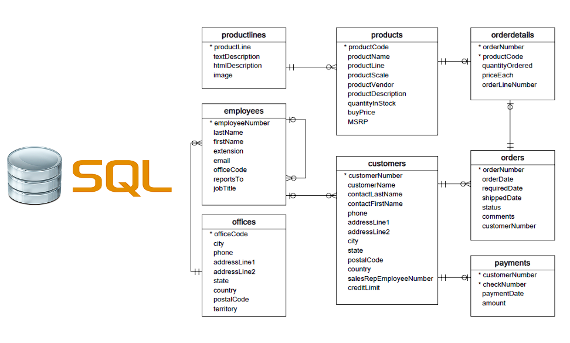
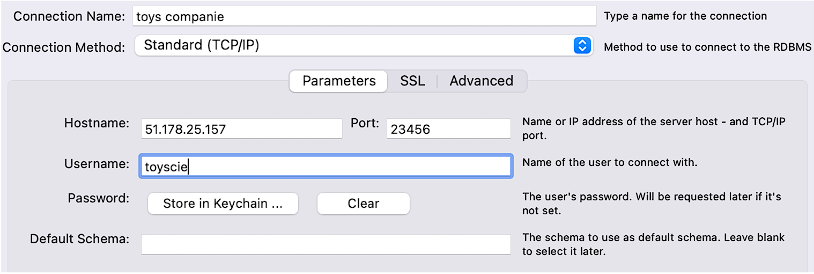

# Introduction

{: .text-center }

You are commissioned by a company selling models and scale models. 

The company already has a database that lists employees, products, orders, and much more. You are invited to browse and discover this database.

**The director of the company wishes to have a dashboard which he could refresh each morning to have the latest information in order to manage the company.**

# Goal & Objectives

Your dashboard should revolve around these 4 main topics: **sales**, **finance**, **logistics**, and **human resources**.  
Here are the mandatory indicators that should be present in your dashboard. It is recommended to create additional KPIs. This part is very important in order to develop your skills/creativity as a data analyst.

- <u><b>Sales</b></u>: The number of products sold by category and by month, with comparison and rate of change compared to the same month of the previous year.
- <u><b>Finances</b></u>:
  - The turnover of the orders of the last two months by country.
  - Orders that have not yet been paid.
- <u><b>Logistics</b></u>: The stock of the 5 most ordered products.
- <u><b>Human Resources</b></u>: Each month, the 2 sellers with the highest turnover.

Sometimes business indicators are not technically achievable. It is up to you to explain it and to bring your own ideas to answer the business needs.
{: .alert-info }

# Resources

Here is the diagram of the database:

{: .text-center }

# Tools

The manager does not want to work with SQL but wants to access the data automatically and graphically. You can propose a tool of your choice (Power BI, Tableau, etc.), as long as the dashboard is relevant.

For information, the database is available on a company server. You can access it in read-only mode with a provided user account.

The company also provides you with the script that you can run on your local MySQL server. The data are identical and stop at the end of the previous month.

During the demo week, new and fresh data will be sent (you will receive the update script if you do it locally). The demo should display the latest available data.

# SQL Database

You have the choice between connecting to the cloud server or deploying the script locally. The data are identical in both cases.

## Local Installation

You can install a MySQL Community server on your machine, as well as the MySQL Workbench client. The database is ready to be loaded into a MySQL server. Connect to your server via Workbench, and run [all of the code in this file](https://drive.google.com/file/d/103Qm2gwiTkRFlHH4Sn-dOSAW97b8zX8U/view?usp=sharing).

## Cloud Server

You can connect to the MariaDB (a fork of MySQL) server of the company.

- **Hostname**: **51.178.25.157**
- **Port**: **23456**
- **Username**: **toyscie**
- **Password**: **WILD4Rdata!**

# Connection with MySQL Workbench

{: .text-center }

# Notes

You can choose your own reporting tool. However, the goal is to practice **SQL**. Therefore, you need to get the data through SQL queries. For example, for the “2 sellers with the highest turnover for each month”:

## <b>What we would like:</b>
<b>A SQL query showing **only** the “2 sellers with the highest turnover for each month,” and a dataviz to show this.</b>

## <b>What we don't want:</b>
<b>A SQL query showing every seller, then filtering in your reporting tool.</b>

# Expected Deliverable

You will give a short presentation of your dashboard (ask your trainer for the duration). The presentation should include:

- **Overview of the context, team presentation, and tools used.**
- **Demo of your dashboard, and business interpretation of KPIs.**
- **Difficulties encountered and perspectives of evolution.**

**Feel free to create additional KPIs!**
