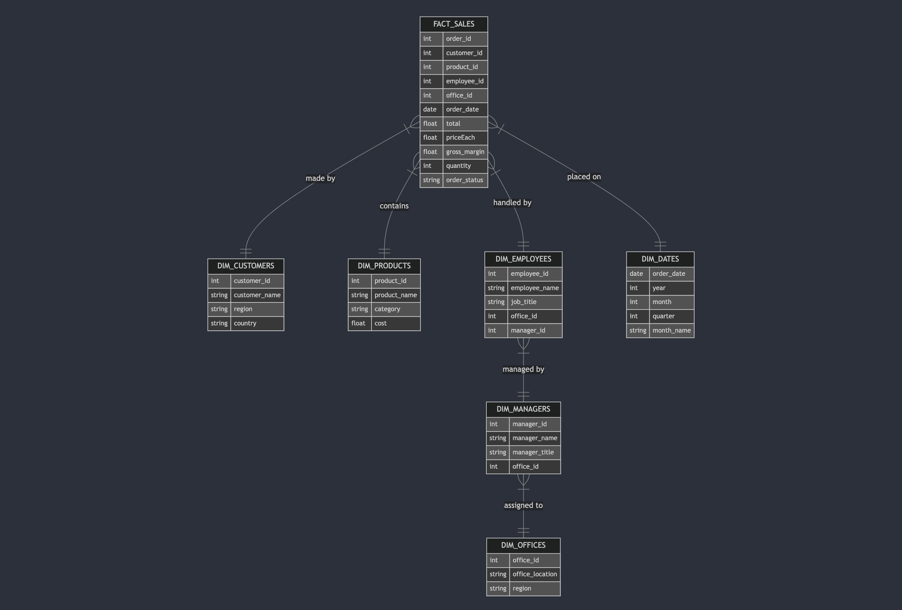

{: .text-center }

## Introduction

Vous êtes mandaté par une entreprise qui vend des modèles et des maquettes.

L’entreprise possède déjà une base de données qui répertorie les employés, les produits, les commandes et bien plus encore. Vous êtes invité à explorer et découvrir cette base de données.

**Le directeur de l’entreprise souhaite avoir un tableau de bord dynamique qu’il pourrait actualiser chaque matin pour obtenir les dernières informations afin de gérer l’entreprise.**

## Objectif & Enjeux

Votre tableau de bord doit s'articuler autour de ces 4 sujets principaux : **ventes**, **finances**, **logistique**, et **ressources humaines**.

Les **indicateurs clés de performance** (**KPI**) ci-dessous sont requis pour ce tableau de bord, avec une distinction claire entre les priorités définies par le client :

- 🔴 **Rouge** : Indicateurs obligatoires
- 🟢 **Vert** : Indicateurs complémentaires
- ⚫ **Noir** : Indicateurs optionnels

Il est recommandé de **proposer des KPI supplémentaires**, surtout en cas d’impossibilité technique de répondre à certaines demandes. Cette partie est essentielle pour démontrer votre créativité et vos compétences en tant que data analyst.

## I. Partie 1 : Calcul des Métriques en SQL

### 📌 Objectif de la Partie SQL

Tout d'abord, vous allez tester et étendre vos  compétences en **SQL** en récupérant tous ces **KPIs** ! Cela va vous permettre de progresser dans l'écriture de requêtes complexes, ce qui est **essentiel** !

En effet, être capable de requêter les données de manière efficace est la fondation **indispensable** pour pouvoir **valoriser** la donnée ! D'ailleurs, les entretiens techniques de data analyst en entreprise sont souvent basés sur des exercices de requêtage SQL, pour ces même raisons !

### Calcul des KPI en SQL

Vous devez écrire des requêtes SQL pour calculer les indicateurs suivants. Vous pouvez également ajouter des indicateurs supplémentaires si vous le souhaitez.

### 📌 Ressources humaines

- 🔴 **Performance des représentants commerciaux** : Calculer le chiffre d’affaires généré par chaque employé chargé des ventes.
- 🟢 **Ratio commandes/paiements par représentant commercial** : Identifier les écarts entre les commandes passées et les paiements reçus pour chaque représentant.
- 🟢 **Performance des bureaux** : Mesurer le chiffre d’affaires généré par chaque bureau.

### 📌 Ventes

- 🔴 **Chiffre d’affaires par mois et par région + taux d’évolution mensuel** : Suivre les revenus générés par région et par mois pour identifier les tendances géographiques.
- 🔴 **Produits les plus/moins vendus par catégorie** : Identifier les produits les plus performants dans chaque catégorie.
- 🟢 **La marge brute par produit et par catégorie** : Mesurer la marge brute et en déduire les produits/catégories les plus/moins rentables.
- ⚫ **Taux d’évolution mensuel des ventes par catégorie** : Mesurer la performance de chaque catégorie de produit dans le temps.
- ⚫ **Panier moyen** : Mesurer le panier moyen des commandes.
- ⚫ **Taux de retour des clients (repeat customers)** : Mesurer la fidélité des clients en identifiant ceux qui passent plusieurs commandes.

### 📌 Finances

- 🔴 **Clients générant le plus/moins de revenus** : Identifier les clients générant le plus de revenus pour mieux les fidéliser.
- 🟢 **Taux de recouvrement des créances par client** : Identifier les clients ayant un montant élevé de commandes non payées.
- ⚫ **Croissance des ventes par trimestre** : Identifier les tendances saisonnières ou les opportunités de croissance.
- ⚫ **Montant moyen des paiements + clients en dessous de la moyenne** : Évaluer la capacité de paiement des clients.
- ⚫ **Taux de paiement par délai** : Identifier combien de temps les clients mettent pour payer après une commande.

### 📌 Logistique

- 🔴 **Stock des produits sous seuil critique** : Identifier les produits dont le stock est faible pour éviter les ruptures.
- 🟢 **Durée moyenne de traitement des commandes + commandes au-dessus de la moyenne de livraison** : Mesurer l’efficacité opérationnelle en analysant le temps entre la date de commande et la date d’expédition.
- ⚫ **Taux d’écoulement des stocks** : Mesurer la rapidité avec laquelle les stocks sont vendus pour chaque produit.
- ⚫ **Taux de commandes livrées en retard** : Identifier les problèmes logistiques et améliorer les délais de livraison.

### I. Partie 2 : Calcul des Métriques en SQL

Après avoir développé vos compétences en SQL pour écrire des requêtes, nous allons maintenant aborder un autre aspect essentiel : l'optimisation des requêtes pour Power BI.

Power BI fonctionne beaucoup mieux avec un schéma analytique, tel qu'un modèle en étoile, plutôt qu'avec un schéma transactionnel.

Manque de chance, la base de données toys and models est basée sur un **schéma transactionnel**.

> Mais qu'est-ce qu'un schéma transactionnel et un schéma analytique ?

Le **schéma transactionnel** (OLTP) est conçu pour gérer les données de manière efficace et cohérente, en évitant la redondance et en garantissant l'intégrité des informations, même lorsqu'elles sont mises à jour. Tout le travail de modélisation que nous avons réalisé jusqu'ici avec la méthode MERISE visait à construire ce type de schéma.
Son objectif principal est de faciliter les opérations transactionnelles comme l'ajout, la modification et la suppression de données. Toutefois, pour l'analyse — comme dans un projet de tableau de bord — ce schéma devient moins performant, car il nécessite de nombreuses jointures, ce qui ralentit considérablement les requêtes et l'affichage des résultats !

En revanche, le **schéma analytique** (OLAP) est optimisé pour l'analyse des données, c'est ce dont nous avons besoin ! Dans ce modèle, nous **choisissons** d'introduire des redondances en regroupant toutes les informations et métriques cruciales dans une seule table appelée **table de faits**. Dans les autres tables, nous allons placer les données descriptives et non numériques, appelée **tables de dimensions**.
Ce compromis améliore significativement la performance. Moins de jointures sont nécessaires, les calculs sont optimisés, et les performances dans Power BI sont nettement meilleures. En résumé, un modèle analytique permet de tirer pleinement parti des capacités de Power BI pour la visualisation et l’analyse des données.

💡 **Objectif**


L'enjeu de cette deuxième partie va donc être de transformer notre modèle **transactionnel** (OLTP) en modèle **analytique** (OLAP) pour faciliter notre travail sur PowerBI !

Afin de faciliter leur récupération dans Power BI, vous devez créer des **vues SQL** qui préparent les **tables de faits** et **tables de dimensions** en amont. Cela permettra d’optimiser la performance et de garantir des données prêtes à l’emploi !

### 📌Méthode à suivre pour créer les tables de faits et de dimensions

**1. Créer une ou plusieurs tables de faits**

Les tables de faits centralisent les informations nécessaires au calcul des indicateurs de performance.

Par exemple, une table `fact_sales` pourrait contenir :

- **Clés étrangères** : permettant de faire le lien avec les tables de dimensions (`customer_id`, `product_id`, `employee_id`, `order_date`).
- **Identifiants** : tels que order_id pour identifier chaque commande.
- **Données analytiques** : toutes les informations permettant de réaliser des mesures (ex. `quantity_sold`, `unit_price`, `total_revenue`, `delivery_status`...).
  👉 Autres exemples de tables de faits :
- `fact_payments` : regroupe les informations sur les paiements effectués par les clients.
- `fact_inventory` : contient les données liées à la logistique et à la gestion des stocks.

**2. Créer des tables de dimensions.**

Les tables de dimensions stockent les informations descriptives qui permettent d’analyser les faits sous différents angles.
Exemples de tables de dimensions :

- `dim_customers` : liste des clients avec leurs informations (`customer_id`, `customer_name`, `region`, `country`...).
- `dim_products` : détails des produits (`product_id`, `product_name`, `category`, `unit_price`...).
- `dim_dates` : table calendrier permettant les analyses temporelles (`date_id`, `year`, `month`, `week`, `day`...).
  Autres dimensions : `dim_employees`, `dim_offices`, `dim_managers`…

👉 **Exemple de structure :**

- `fact_sales` : table de fait contenant les informations de ventes : quantité commandé, chiffre d'affaires …
- `dim_customers` : Clients (Nom, Région,...)
- `dim_products` : Produits (Nom, Catégorie …)
- `dim_employees` : Employés (Nom, job title,...)
- `dim_manager` :  Managers (Nom, job title…)
- `dim_office` :  Offices ( Bureau , country…)
- `dim_dates` : Dates pour les analyses temporelles  (Peut-être faite en SQL ou sur PowerBI)

Exemple de schéma en étoile possible



## II : Construction du Dashboard dans Power BI

### 📌 Pourquoi utiliser Power BI après SQL ?

Power BI va permettre de récupérer directement les vues SQL créées et de les utiliser comme des tables liées dans un modèle de données. Cela facilite :

- ✅ La gestion des filtres et relations entre les tables
- ✅ L’actualisation automatique des données
- ✅ L’affichage rapide des indicateurs clés

### 📍 Travail à réaliser en Power BI

- Importer les vues SQL créées depuis MySQL.
- Établir les relations entre les tables selon le schéma en étoile.
- Créer les visualisations (graphiques, tableaux, KPI) en utilisant les métriques demandées.
- Créer des filtres interactifs pour explorer les données en fonction des régions, produits, employés, etc.
- S’assurer que le tableau de bord est actualisable quotidiennement.

💡 **Livrable attendu** : Un tableau de bord Power BI complet avec les indicateurs demandés, basé sur les vues SQL créées en amont.

## Conclusion

Vous devrez structurer les données en SQL avant de les exploiter dans Power BI. Ce projet vous permettra de comprendre l’importance du Data Modeling, d’optimiser les performances des requêtes et de créer un dashboard interactif qui répond aux besoins d’un directeur d’entreprise.

🚀 À vous de jouer !

**Note importante** : Les stocks sont mis à jour tous les deux mois. Par conséquent, les données actuelles reflètent uniquement les deux derniers mois.
{: .alert-info }

Si des limitations techniques empêchent de répondre à certains KPI, proposez des alternatives alignées avec les objectifs métiers du client.
{: .alert-warning }

## Ressources

Requetes pour générer la dim_date :

```sql
SET @@cte_max_recursion_depth = 3000;
CREATE VIEW DIM_DATES AS
WITH RECURSIVE date_series AS (
    SELECT DATE('2019-01-01') AS full_date
    UNION ALL
    SELECT DATE_ADD(full_date, INTERVAL 1 DAY)
    FROM date_series
    WHERE full_date < DATE('2025-12-31')
)
SELECT
    full_date AS order_date,
    YEAR(full_date) AS year,
    MONTH(full_date) AS month,
    QUARTER(full_date) AS quarter,
    DATE_FORMAT(full_date, '%M') AS month_name,
    WEEK(full_date, 1) AS week_number,
    DAY(full_date) AS day_of_month,
    DAYNAME(full_date) AS day_name
FROM date_series;
```

Voici le schéma de la base de données :


{: .text-center }

## Outils

Le directeur ne souhaite pas travailler avec SQL mais veut accéder aux données automatiquement et graphiquement. Vous pouvez proposer l'outil de votre choix (Power BI, Tableau, etc.), tant que le tableau de bord est pertinent.

À titre d'information, la base de données est disponible sur un serveur de l'entreprise. Vous y accédez en mode lecture seule avec un compte utilisateur fourni.

L'entreprise vous fournit également le script que vous pouvez exécuter sur votre serveur MySQL local. Les données sont identiques et s'arrêtent à la fin du mois précédent.

## Base de données SQL

Vous avez le choix entre vous connecter au serveur cloud ou déployer le script localement. Les données sont identiques dans les deux cas.

### Installation locale

Vous pouvez installer un serveur MySQL Community sur votre machine, ainsi que le client MySQL Workbench. La base de données est prête à être chargée dans un serveur MySQL. Connectez-vous à votre serveur via Workbench, et exécutez [tout le code dans ce fichier](https://drive.google.com/file/d/103Qm2gwiTkRFlHH4Sn-dOSAW97b8zX8U/view?usp=sharing).

### Serveur cloud

Vous pouvez vous connecter au serveur MariaDB (un fork de MySQL) de l'entreprise.

- **Hostname**: **51.178.25.157**
- **Port**: **23456**
- **Username**: **toyscie**
- **Password**: **WILD4Rdata!**

## Connexion avec MySQL Workbench


{: .text-center }

## Livrable attendu

Vous fournirez le fichier SQL des requêtes de la partie 1.1.
Ensuite, vous donnerez une courte présentation de votre tableau de bord (demandez à votre formateur la durée). La présentation doit inclure :

- **Vue d'ensemble du contexte, présentation de l'équipe et des outils utilisés.**
- **Démonstration de votre tableau de bord, et interprétation des KPI métiers.**
- **Difficultés rencontrées et perspectives d'évolution.**

**N'hésitez pas à créer des KPI supplémentaires !**
