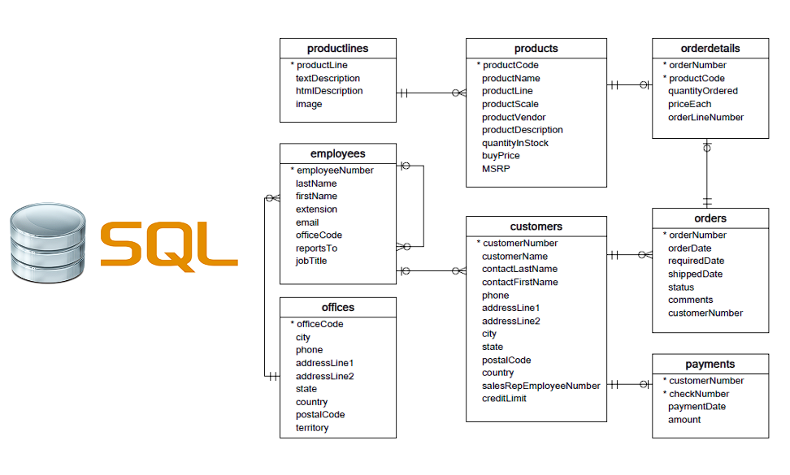
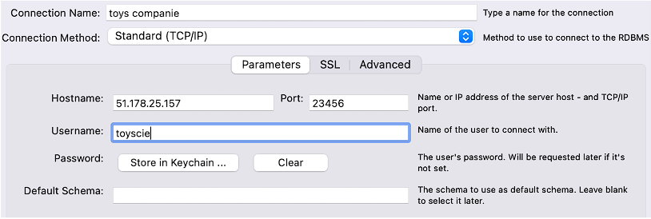

# Introduction

{: .text-center }

Vous êtes mandaté par une entreprise qui vend des modèles et des maquettes.

L'entreprise possède déjà une base de données qui répertorie les employés, les produits, les commandes et bien plus encore. Vous êtes invité à explorer et découvrir cette base de données.

**Le directeur de l'entreprise souhaite avoir un tableau de bord qu'il pourrait actualiser chaque matin pour obtenir les dernières informations afin de gérer l'entreprise.**

# Objectif & Enjeux

Votre tableau de bord doit s'articuler autour de ces 4 sujets principaux : **ventes**, **finances**, **logistique**, et **ressources humaines**.
Voici les indicateurs obligatoires qui doivent figurer dans votre tableau de bord. Il est recommandé de créer des KPI supplémentaires. Cette partie est très importante pour développer vos compétences/créativité en tant que data analyst.

- <u><b>Ventes</b></u> : Le nombre de produits vendus par catégorie et par mois, avec comparaison et taux de variation par rapport au même mois de l'année précédente.
- <u><b>Finances</b></u> :
  - Le chiffre d'affaires des commandes des deux derniers mois par pays.
  - Les commandes qui n'ont pas encore été payées.
- <u><b>Logistique</b></u> : Le stock des 5 produits les plus commandés.
- <u><b>Ressources humaines</b></u> : Chaque mois, les 2 vendeurs ayant réalisé le plus de chiffre d'affaires.

Il arrive parfois que certains indicateurs métiers ne soient pas réalisables techniquement. C'est à vous d'expliquer pourquoi et de proposer vos propres idées pour répondre aux besoins métiers.
{: .alert-info }

# Ressources

Voici le schéma de la base de données :

{: .text-center }

# Outils

Le directeur ne souhaite pas travailler avec SQL mais veut accéder aux données automatiquement et graphiquement. Vous pouvez proposer l'outil de votre choix (Power BI, Tableau, etc.), tant que le tableau de bord est pertinent.

À titre d'information, la base de données est disponible sur un serveur de l'entreprise. Vous y accédez en mode lecture seule avec un compte utilisateur fourni.

L'entreprise vous fournit également le script que vous pouvez exécuter sur votre serveur MySQL local. Les données sont identiques et s'arrêtent à la fin du mois précédent.

Pendant la semaine de démonstration, de nouvelles données fraîches seront envoyées (vous recevrez le script de mise à jour si vous le faites localement). La démo devra afficher les dernières données disponibles.

# Base de données SQL

Vous avez le choix entre vous connecter au serveur cloud ou déployer le script localement. Les données sont identiques dans les deux cas.

## Installation locale

Vous pouvez installer un serveur MySQL Community sur votre machine, ainsi que le client MySQL Workbench. La base de données est prête à être chargée dans un serveur MySQL. Connectez-vous à votre serveur via Workbench, et exécutez [tout le code dans ce fichier](https://drive.google.com/file/d/103Qm2gwiTkRFlHH4Sn-dOSAW97b8zX8U/view?usp=sharing).

## Serveur cloud

Vous pouvez vous connecter au serveur MariaDB (un fork de MySQL) de l'entreprise.

- **Hostname**: **51.178.25.157**
- **Port**: **23456**
- **Username**: **toyscie**
- **Password**: **WILD4Rdata!**

# Connexion avec MySQL Workbench

{: .text-center }

# Notes

Vous pouvez choisir votre propre outil de reporting. Cependant, l'objectif est de pratiquer **SQL**. Par conséquent, vous devez obtenir les données via des requêtes SQL. Par exemple, pour les "2 vendeurs ayant réalisé le plus de chiffre d'affaires chaque mois" :

## <b>Ce que nous aimerions voir :</b>

<b>Une requête SQL montrant **uniquement** les "2 vendeurs ayant réalisé le plus de chiffre d'affaires chaque mois", et une dataviz pour l'afficher.</b>

## <b>Ce que nous ne voulons pas :</b>
<b>Une requête SQL montrant tous les vendeurs, puis un filtrage dans votre outil de reporting.</b>

# Livrable attendu

Vous donnerez une courte présentation de votre tableau de bord (demandez à votre formateur la durée). La présentation doit inclure :

- **Vue d'ensemble du contexte, présentation de l'équipe et des outils utilisés.**
- **Démonstration de votre tableau de bord, et interprétation des KPI métiers.**
- **Difficultés rencontrées et perspectives d'évolution.**

**N'hésitez pas à créer des KPI supplémentaires !**