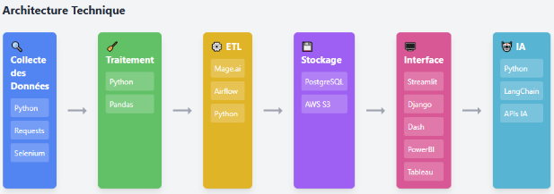

## Introduction et Contexte

{: .text-center}

Le projet **WildFindJob** a pour objectif de fournir une solution innovante pour l’analyse du marché de l’emploi dans la DATA. En mettant en œuvre des techniques modernes de collecte, traitement, et automatisation des données, ce projet permet de répondre aux besoins des clients en termes de recherche d’offres d’emploi, d’analyse de tendances, et d’intégration de fonctionnalités IA.

Le projet est organisé en plusieurs phases, allant de la collecte initiale des données à la présentation finale via une interface utilisateur interactive.

## Objectifs Pédagogiques

- Comprendre et appliquer les techniques d’extraction de données via APIs et web scraping.
- Maîtriser le nettoyage, la transformation, et l’organisation des données en créant un modèle de données.
- Concevoir et déployer un pipeline ETL automatisé pour garantir l’extraction, le contrôle de qualité, la mise à jour des données et la préparation d’ingestion des données dans un SGBDR.
- Acquérir des compétences en stockage et manipulation des données dans PostgreSQL.
- Développer une interface de dashboarding simple et intuitive pour présenter les résultats et analyses.
- Implémenter des fonctionnalités IA pour l’analyse du marché de l’emploi, la recommandation et l’interaction utilisateur.

## Organisation

Le projet se déroule en 4 semaines et se découpe en six étapes principales :

1. Collecte et Extraction des Données.
2. Traitement et Nettoyage des Données.
3. Automatisation ETL.
4. Stockage et Infrastructure.
5. Fonctionnalités IA.
6. Interface Utilisateur.

Chacune de ces phases est réalisée de manière collaborative et itérative en respectant la méthodologie AGILE. Les outils et technologies utilisés seront recommandés pour optimiser l’efficacité et la portée du projet.

## Phases de Développement

1. **Collecte et Extraction des Données**

    - **Technologies** : Python, requests, Selenium.
    - **Objectif** : Récupérer les offres d’emploi via APIs et scraping, et collecter d’autres données associées (CV, etc.).

2. **Traitement et Nettoyage des Données**

    - **Technologies** : Python, pandas.
    - **Objectif** : Nettoyer, dédupliquer et standardiser les données pour créer un modèle de données optimal.

3. **Automatisation ETL**

    - **Technologies** : Mage AI, Airflow, Python.
    - **Objectif** : Automatiser les processus d’extraction, transformation et chargement des données.

4. **Stockage et Infrastructure**

    - **Technologies** : PostgreSQL (local et cloud), AWS S3.
    - **Objectif** : Centraliser et sécuriser les données tout en assurant leur accessibilité.

5. **Interface Utilisateur**

    - **Technologies** : Streamlit, Django, Dash, PowerBI, Tableau...
    - **Objectif** : Offrir une interface intuitive pour présenter les résultats et permettre aux utilisateurs d’interagir avec les données.

6. **Fonctionnalités IA**

    - **Technologies** : Python, API des IAs (Gemini, xAI, OpenAI, DeepSeek-V3...), LangChain, OpenAI.
    - **Objectif** : Fournir des analyses de marché, des recommandations et des interactions IA suivant les besoins des clients.

{: .text-center}

## Missions et Livrables Attendus

- Scripts Python pour la collecte et l’extraction de données.
- Codes de traitement et nettoyage des données avec pandas.
- Pipeline ETL fonctionnel déployé sur Mage AI ou Airflow.
- Base de données PostgreSQL contenant des données nettoyées et mises à jour.
- Interface dashboarding utilisateur interactive présentant les résultats et analyses.
- Application déployée (Streamlit / GitHub…).

## Ressources

- [Documentation et tutoriels sur les technologies utilisées](https://docs.google.com/document/d/125OscHfCOOmu_XtHZj9acDnzxyCBG1vF0SHSBnodIpY/edit?usp=sharing)
