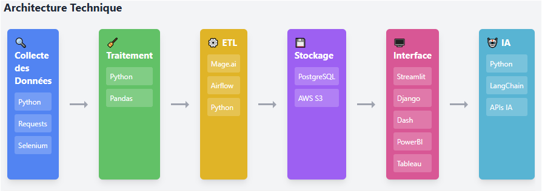

## Introduction et Contexte

{: .text-center}

Le projet vise à développer une solution complète d'analyse de données permettant de collecter, traiter et visualiser des informations à partir de diverses sources. Cette approche permet aux utilisateurs de bénéficier d'insights pertinents grâce à des tableaux de bord interactifs et des analyses approfondies notamment avec de l'utilisation de la puissance des API de l'IA-Générative.

## Objectifs Pédagogiques

- Maîtriser les techniques de collecte de données à partir de différentes sources (APIs, fichiers, bases de données).
- Développer des compétences en prétraitement et nettoyage de données avec Python.
- Concevoir et implémenter un pipeline ETL.
- Gérer efficacement une base de données relationnelle.
- Créer des visualisations interactives et des tableaux de bord dynamiques.
- Explorer les possibilités d'enrichissement par l'intelligence artificielle.

## Organisation

Le projet se déroule sur 4 semaines selon une approche itérative et collaborative, divisée en phases distinctes :

1. Acquisition des Données
2. Traitement et Nettoyage
3. Infrastructure de Données
4. Visualisation
5. Interface Utilisateur
6. Enrichissement IA (optionnel)

{: .text-center}

## Phases de Développement

1. Acquisition des Données

    - **Technologies** : Python, APIs REST, web scraping, fichiers structurés/non-structurés
    - **Objectif** :
        - Mettre en place un système de collecte de données adapté aux sources choisies
        - Assurer une collecte régulière et fiable des données
    - **Lien avec l'étape suivante** : Les données brutes sont transmises au processus de nettoyage

2. Traitement et Nettoyage

    - **Technologies** : Python (pandas, numpy), outils de data cleaning
    - **Objectif** :
        - Nettoyer et structurer les données collectées
        - Standardiser les formats pour une exploitation optimale
    - **Lien avec l'étape suivante** : Les données nettoyées sont prêtes pour l'intégration en base de données

3. Infrastructure de Données

    - **Technologies** : Outil ETL au choix, Base de données PostregreSQL
    - **Objectif** :
        - Implémenter un pipeline ETL automatisé
        - Concevoir et maintenir une base de données adaptée au projet
    - **Lien avec l'étape suivante** : La base de données alimente les visualisations

4. Visualisation

    - **Technologies** : Outils de dataviz (Streamlit, Dash, PowerBI...)
    - **Objectif** :
        - Développer des tableaux de bord dynamiques incluant :
            - Indicateurs clés de performance
            - Graphiques interactifs
            - Analyses temporelles
            - Visualisations géographiques si pertinent
    - **Lien avec l'étape suivante** : Les visualisations sont intégrées à l'interface utilisateur

5. Interface Utilisateur

    - **Technologies** : Framework web/dashboard au choix
    - **Objectif** : Créer une interface intuitive permettant :
        - La recherche et le filtrage des données
        - La personnalisation des visualisations
        - L'export des résultats
        - La sauvegarde des préférences utilisateur

6. Enrichissement IA (Optionnel)

    - **Technologies** : Frameworks IA/ML, APIs IA
    - **Objectifs** :
        - Analyse prédictive des données
        - Classification automatique
        - Traitement du langage naturel si pertinent
        - Enrichissement des données par IA

## Missions et Livrables Attendus

- Scripts de collecte et d'extraction des données
- Pipeline de nettoyage et prétraitement
- Infrastructure ETL opérationnelle
- Base de données optimisée et documentée
- Tableaux de bord interactifs
- Interface utilisateur fonctionnelle et intuitive
- Documentation technique et guide utilisateur

## Conseils pour le Développement

- Privilégier une approche modulaire et évolutive
- Documenter régulièrement le code et les choix techniques
- Mettre en place des tests unitaires
- Utiliser le contrôle de version (git)
- Planifier des points d'étape réguliers
- Prévoir une phase de test utilisateur
  
## Ressources

- [Liste non-exhaustive des APIs à utiliser](https://docs.google.com/document/d/1dCX3NebD60zSlT4ZJN2Whzxp0t0Z6AexauqmoI6a80k/edit?tab=t.brs3ncpwpypy)
- [Streamlit](https://www.youtube.com/@CodingIsFun/playlists)
- [Dash](https://www.youtube.com/@CharmingData)
