# Git/GitHub 4 : Branche et Flow

## Introduction

Jusqu'à présent, tu as appris à :

- Utiliser Git en local.
- Créer un repo sur GitHub.
- Synchroniser tes fichiers avec git push et git pull.

Mais, en entreprise ou sur des projets collaboratifs, on ne travaille jamais directement sur `main`. 

Pourquoi ? Parce que modifier directement la version principale peut causer des erreurs et empêcher les autres développeurs d’avancer.

C’est pour cela que Git utilise un système de branches.

## 🤓 Objectifs

Dans cette quête, nous allons apprendre à :

✅ Comprendre l'utilité des branches dans un projet Git
✅ Créer une branche et la fusionner via l'interface GitHub
✅ Créer une branche en ligne de commande avec git branch
✅ Naviguer entre les branches avec git checkout
✅ Suivre un workflow GitHub avec plusieurs branches
✅ Comprendre la différence entre git fetch et git pull

## 1 - Pourquoi utiliser des branches ?

**Qu’est-ce qu’une branche Git ?**

Une branche est simplement une version parallèle de ton code. Elle permet de travailler sur de nouvelles fonctionnalités ou de corriger des bugs sans impacter la version principale (main).

Dans la quête précédente, nous avions comparé GitHub à une maison, où main représentait le salon (l’endroit principal où tout est bien rangé).

Cette fois-ci, imaginons plutôt un arbre :

- Le tronc représente la branche main : il est solide et stable.
- Les branches sont des extensions temporairement séparées du tronc, où tu peux expérimenter avant de ramener tes changements.

**Pourquoi les branches sont essentielles ?**

Les branches permettent de :

- Développer sans risque → Tester de nouvelles fonctionnalités sans perturber le code principal.
- Corriger des bugs en isolation → Éviter d’introduire des erreurs pendant que d’autres travaillent sur main.
- Faciliter le travail collaboratif → Chaque développeur peut travailler sur sa propre branche sans écraser le travail des autres.
- Expérimenter librement → Si une idée ne fonctionne pas, on peut supprimer la branche sans toucher au projet principal.

**En résumé : Une branche est un espace de travail isolé pour améliorer un projet sans risquer de tout casser.**

## 2 - Le Git Flow en image

Voici un exemple simple de workflow Git utilisé par de nombreuses équipes :

La branche main contient le code stable et en production.

La branche develop est la branche principale où les nouvelles fonctionnalités sont intégrées et testées avant d’être envoyées en production (dans la branche main).

Les deux branches features des branches temporaires créées pour développer de nouvelles fonctionnalités sans impacter la branche develop ni la branche main.

Une fois une feature terminée et testée, elle est fusionnée dans develop, puis dans main via une Pull Request (nous verrons les Pull Requests plus tard.)

## 3 - Créer une branche sur GitHub (interface graphique)

Commençons par la méthode la plus simple : créer une branche directement sur GitHub.

**1️ - Je crée un nouveau repo sur GitHub** que j'appelle repo_branches avec un fichier README.md.

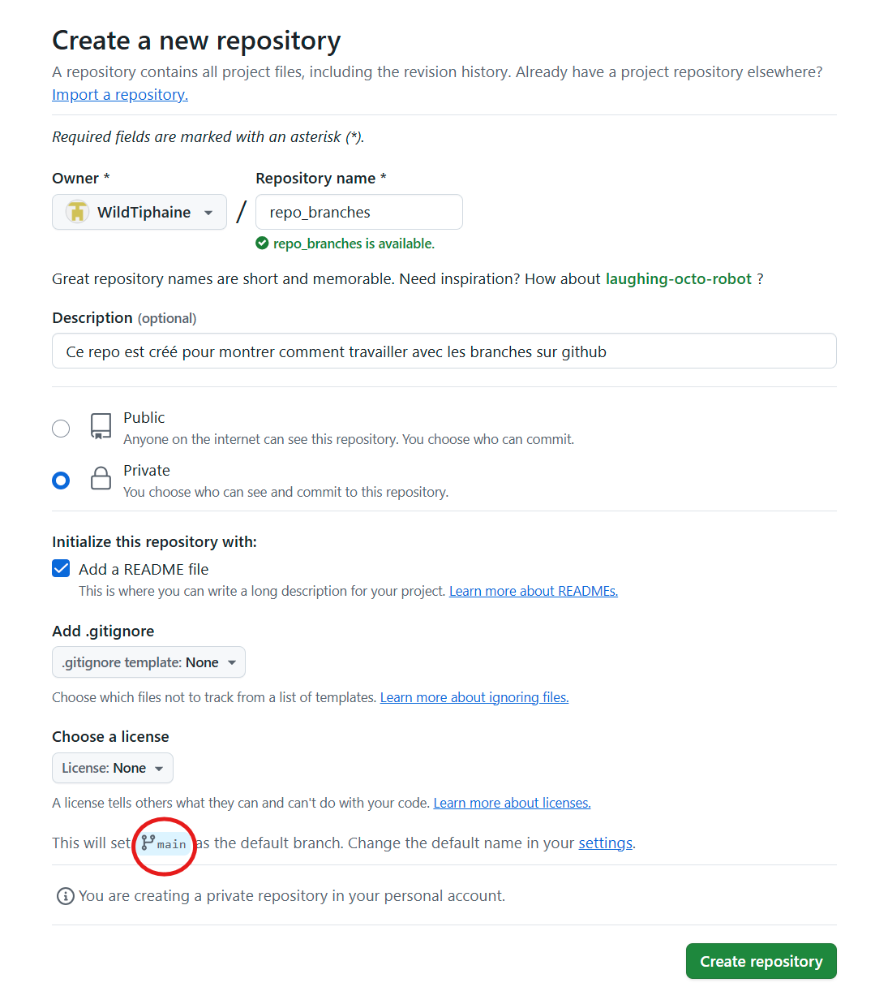

Tu vois que le repo se créé sur la branche `main`. 

**2️ - Je crée une nouvelle branche sur GitHub**

Une fois le repo créé, je peux créer une nouvelle branche directement sur GitHub :

- Je clique sur le menu déroulant "main"
- Je saisis le nom de ma nouvelle branche : new-feature
- Je clique sur "Create branch: new-feature from 'main'"

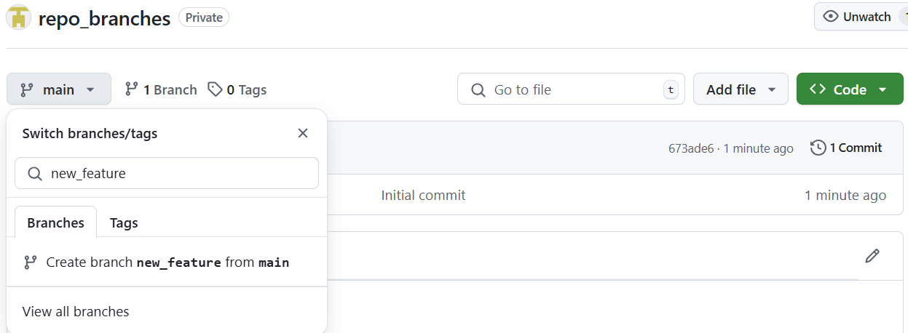

Et basculer dessus :

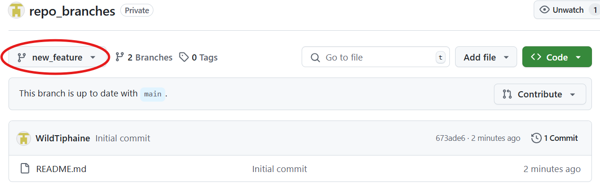

Pour l'instant, il n'y a aucune différence entre ma branche `main` et ma branche `new_feature`.

**3 - Je créé un fichier et je le commit**

Maintenant que je suis sur ma branche new-feature, j'ai créé un fichier 'math_utils.py' qui a créé une nouvelle feature.

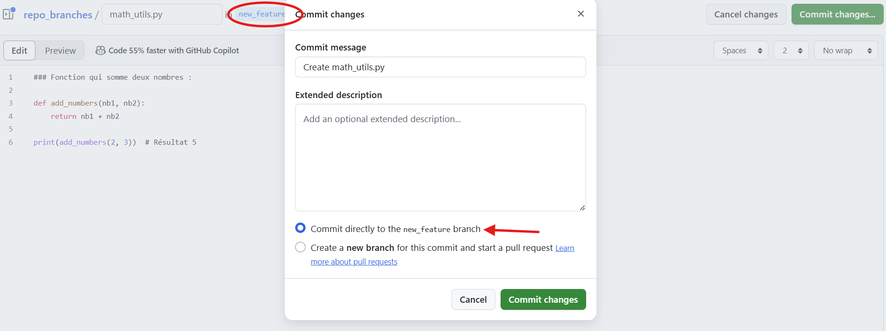

Dans l'image ci-dessous, nous pouvons maintenant voir l'information **'1 commit ahead of main'**, ce qui veut dire ...

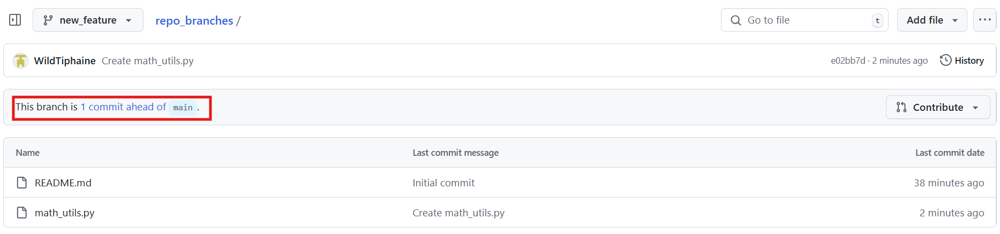

Quand je clique sur ce commit, je peux alors voir les différences entre les deux branches.

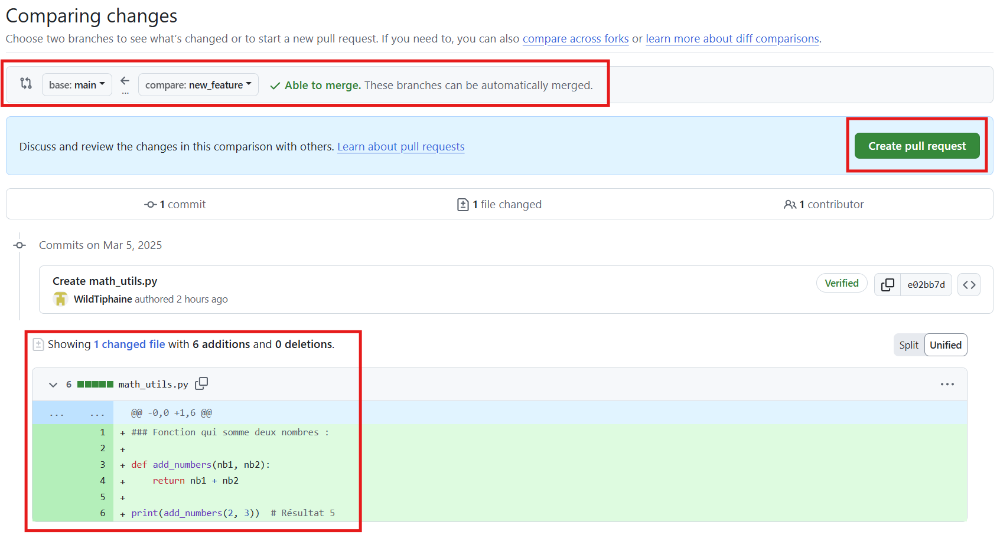

Github utilise un code couleur pour constater les différences : 

**Vert → Ajout**

Les lignes vertes indiquent du nouveau code ajouté. 
Ici, la création du fichier math_utils.py avec la fonction add_numbers() est en vert, car elle n'existait pas avant.

**Rouge → Suppression (non présente dans la capture écran)**

Si un fichier ou une ligne a été supprimé(e), elle apparaît en rouge.

**3️ - Bleu → Modification de fichier**

La ligne bleue en haut indique où se trouvent les modifications dans le fichier.

Explication des éléments : `@@ -0,0 +1,6 @@`

`-0,0` → Avant la modification, il n'y avait rien dans ce fichier (puisqu'il est nouveau).

`+1,6` → Le nouveau contenu commence à la ligne 1 et s’étend sur 6 lignes.

Traduction : "On a ajouté 6 lignes à partir de la ligne 1".

## 4 - Pull Request

Maintenant que nous avons créé une branche et ajouté notre fonction, nous voulons intégrer ces modifications à notre branche principale `main`. Pour cela, nous allons utiliser une Pull Request.

#### 4.1 - Qu'est-ce qu'une Pull Request ?

Une Pull Request (souvent abrégée en "PR") est une demande pour fusionner les modifications d'une branche vers une autre, généralement de la branche de fonctionnalité vers la branche principale (main).
Les Pull Requests sont très importantes dans les projets collaboratifs car elles permettent :

- De documenter les changements apportés au code
- D'examiner le code avant qu'il ne soit fusionné (code review)
- De discuter des modifications et de suggérer des améliorations
- De tester automatiquement les modifications avant la fusion

#### 4.2 - Je crée une Pull Request

Dans github, tu as la possibilité de cliquer sur l'onglet **"pull request"**. Sinon, après avoir cliqué sur "This branch is 1 commit ahead of main" tu as également la possibilité de cliquer sur **"create pull request"**

Je vérifie que je fusionne bien ma branche new_feature dans main, puis je clique sur "Create pull request".

Je remplis les informations de la Pull Request.

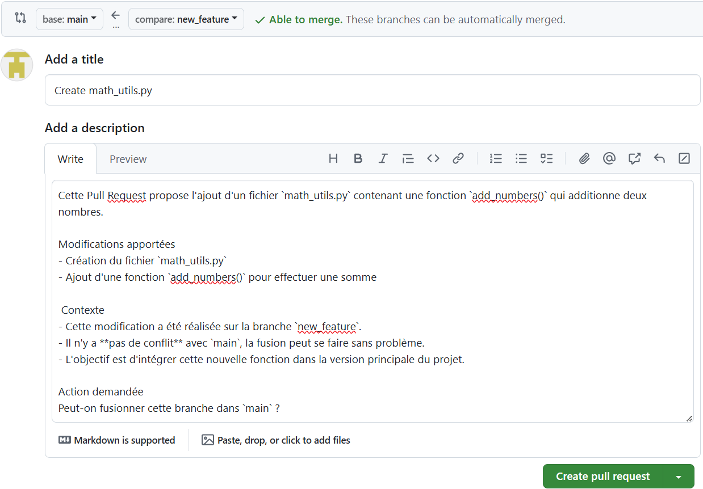

>Un bon développeur documente toujours clairement ses modifications pour que les autres comprennent ce qu'il a fait et pourquoi.
>
>J'ajoute donc :
>
>- Un titre clair qui résume la modification ("Create math_utils.py")
>- Une description détaillée qui explique :
>
>- Ce que j'ai ajouté (un fichier math_utils.py avec une fonction add_numbers())
>- Le contexte (branche utilisée, absence de conflits)
>- L'objectif (intégrer cette fonction dans la version principale)

Une fois que j'ai rempli ces informations, je clique sur **"Create pull request"**.

#### 4.3 - Je fusionne ma Pull Request

Dans un contexte d'équipe, les autres développeurs examineraient maintenant mon code et pourraient laisser des commentaires. 
Comme je suis seul sur ce projet, je peux directement fusionner ma Pull Request.

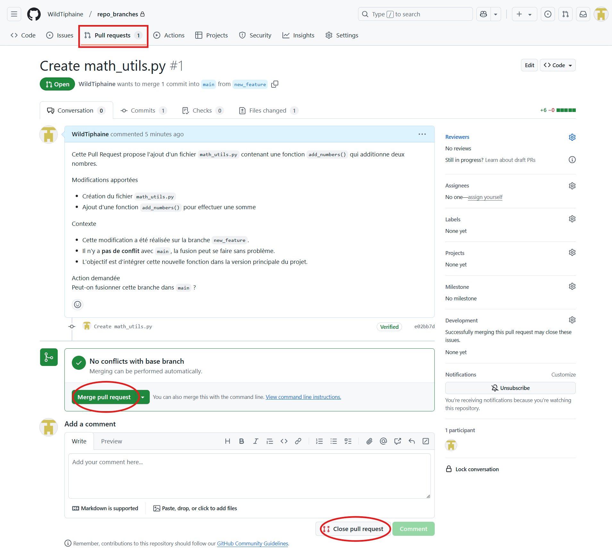

Je clique sur "Merge pull request", puis sur "Confirm merge". 
Si j'avais cliqué sur **"close pull request"**, cela fermerait la Pull Request sans fusionner les modifications.

**"Merge"** accepte et intègre les changements, tandis que **"Close"** les rejette ou les reporte.

GitHub me confirme que ma branche a été fusionnée et me propose de supprimer la branche, ce que je fais car je n'en ai plus besoin :

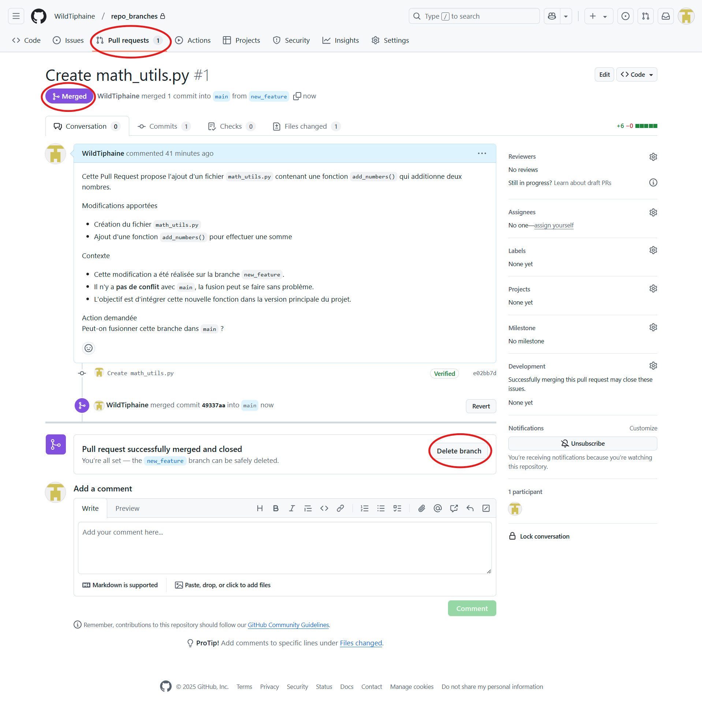

Et voilà ! Mes modifications sont maintenant intégrées à la branche principale main.

## 5 - Git clone : récupérer un repo distant

Jusqu'à présent, nous avons travaillé directement sur GitHub. 
Mais en situation professionnelle, les développeurs travaillent principalement en local, sur leur propre machine.

Pour cela, nous avons besoin de récupérer (cloner) un repo distant sur notre ordinateur. 

C'est ce que permet la commande `git clone`.

#### 5.1 - Qu'est-ce que git clone ?

Git clone est une commande Git qui crée une copie locale complète d'un repo distant, incluant :

- Tous les fichiers du projet
- L'historique complet des commits
- Toutes les branches
- La configuration pour se connecter au repo distant

#### 5.2 - Je clone mon repo GitHub

Pour cloner mon repo repo_branches, je commence par récupérer son URL sur GitHub :

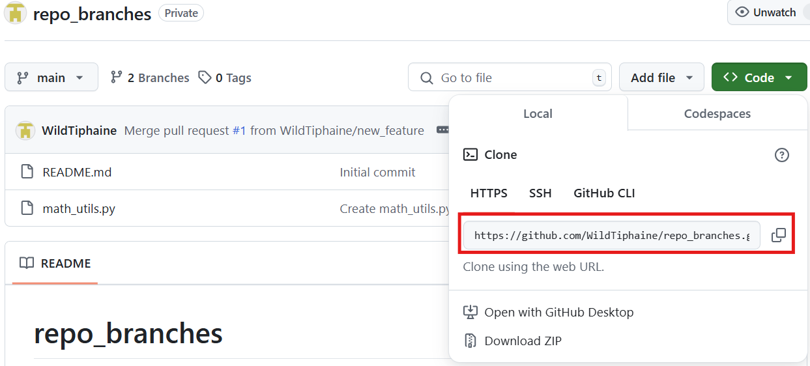

Ensuite, j'ouvre mon terminal, je me rends dans le dossier où je veux télécharger le projet, puis j'exécute la commande suivante :

`git clone url_du_repo`

Git télécharge alors tout le contenu du repo.

Une fois le clonage terminé, un nouveau dossier repo_branches est créé dans mon répertoire courant. Je peux y accéder et voir son contenu avec la commande `ls` ou `dir` selon ton terminal.

Je peux également vérifier les branches disponibles :

`git branch -a`

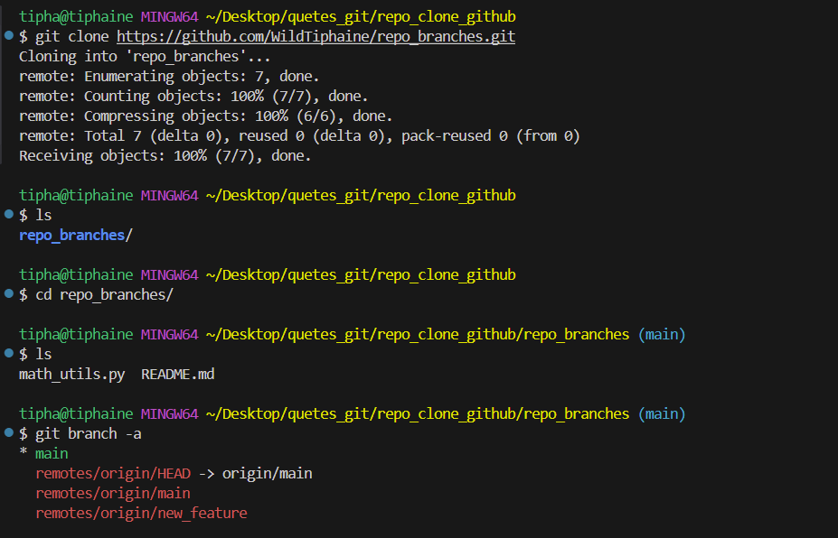

Résultat :

Par défaut, git clone me place sur la branche principale (main). 

Si je veux voir toutes les branches distantes, je peux utiliser `git branch -r`.

Ici il n'y aura pas de différence entre les branches du repo local et celui du repo distant car je viens de le cloner.

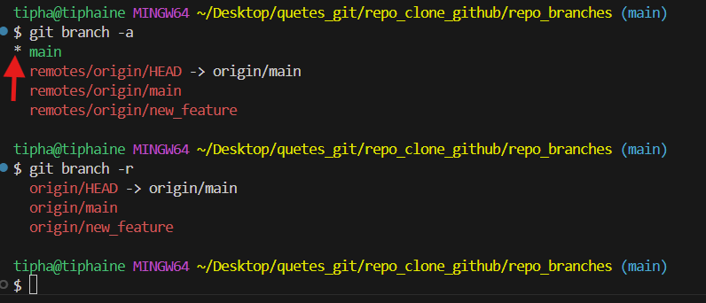

L'astérisque * indique la branche sur laquelle je me trouve actuellement (ici, toujours main).

## 6 - Travailler avec les branches en ligne de commande

Si l'interface GitHub est pratique, les développeurs utilisent plus souvent la ligne de commande pour travailler avec Git. Voyons comment créer et gérer des branches avec les commandes Git.

#### 6.1 - Je crée une branche localement

Pour créer une nouvelle branche, j'utilise la commande :

`git branch nom_de_la_branche` :

Cette commande crée une nouvelle branche, mais ne me place pas dessus automatiquement. 

#### 6.2 - Je bascule sur ma nouvelle branche

Pour me placer sur ma nouvelle branche, j'utilise la commande :

`git checkout nom_de_la_branche_ou_je_veux_aller`

Astuce : Je peux combiner la création et le basculement en une seule commande :

`git checkout -b nom_de_la_branche_que_je_créé`

Cette commande crée la branche et me positionne dessus directement.

Dans l'exemple ci-dessous, j'ai créé une branche **"nouvelle_feature"** et je me suis positionnée dessus.

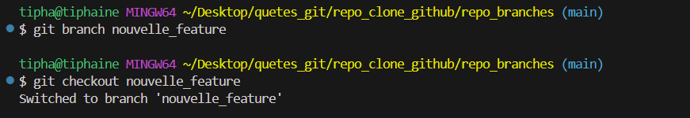

# 💪 Challenge

Pratiquons ça!

1. Crée un nouveau dépôt nommé `website-flow` sur GitHub en cochant «Initialize this repository with a README».
2. Clone le dépôt sur ta machine.
3. Localement (= via Git), crée une nouvelle branche appelée `cheese` et place-toi dessus.
4. Dans ton éditeur de texte préféré, modifie le fichier readme (par exemple, en écrivant une liste de tes fromages à pizza préférés).
5. En t'assurant que tu es bien sur la branche `cheese`, valide tes modifications et transféres-les dans ton dépôt GitHub (rappelle-toi, tu as vu dans la quête précédente comment envoyer ton code sur github).
6. Sur GitHub, fusionne la branche `cheese` avec la branche `main` via une pull request, puis supprime la branche `cheese`.
7. En solution de ce challenge, partage le lien de ton repo GitHub avec `/commits` à la fin

> Ce lien te mènera à l'historique de tous les crimes commis sur ton repo.

# 🧐 Critères de validation :

* [ ] Le lien fourni est un lien vers un dépôt GitHub.

* [ ] Dans l'historique des commits, le commit le plus récent est similaire à la demande de fusion pull #1 de user/cheese où l'utilisation est le nom d'utilisateur de l'étudiant qui a posté sa solution (= la branche cheese a bien été fusionnée dans `main`).

* [ ] Dans l'onglet branche, seule la branche `main` est présente (= la branche cheese a été supprimée).